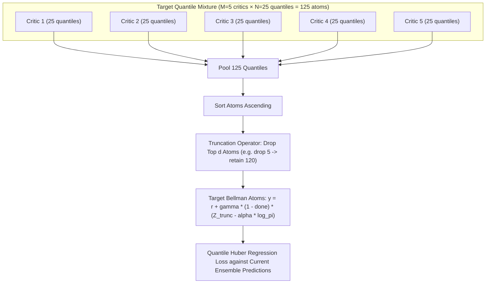

# System Architecture & Technical Specification

This document provides the definitive architectural design, mathematical foundations, module interactions, and data flow for the **TQC (Truncated Quantile Critics) Reproduction & Analysis** project (Kuznetsov et al., ICML 2020).

---

## 1. Mathematical Foundations & Algorithm Mapping

Traditional Continuous Actor-Critic algorithms (such as SAC or TD3) approximate the state-action value $Q(s, a)$ with a single scalar mean. However:
- Taking the maximum or minimum over a small ensemble (e.g., $\min(Q_1, Q_2)$ in Clipped Double Q-learning) often leads to severe underestimation or uncontrolled overestimation bias in high-dimensional continuous control.
- **TQC** replaces scalar value functions with **Distributional Quantile Representations** and introduces a **Truncation Operator** that discards the top $d$ atoms from the pooled mixture of critic distributions.



### Key Mathematical Operations in Code

1. **Quantile Critic Ensemble (`src/tqc/critic.py`)**:
   - $M = 5$ separate critic networks, each outputting $N = 25$ quantiles at cumulative probabilities $\tau_i = \frac{2i - 1}{2N}$ for $i \in \{1, \dots, N\}$.
   - Forward pass yields a tensor of shape `(batch_size, M, N)`.

2. **Truncation Operator (`src/tqc/truncation.py`)**:
   - The target next-state quantiles from all $M$ target critics are pooled into a single tensor of size $M \times N = 125$.
   - Sorted in ascending order: $z_{(1)} \le z_{(2)} \le \dots \le z_{(MN)}$.
   - The top $d$ atoms are truncated, leaving $k = MN - d$ quantiles (e.g., $125 - 5 = 120$).
   - This prevents overestimation of tail returns while maintaining distribution shape.

3. **Quantile Huber Loss (`src/tqc/truncation.py`)**:
   - For predictions $\theta$ and targets $y$, pairwise error $u = y - \theta$.
   - Huber loss $\rho_\tau^\kappa(u) = |\tau - \mathbb{I}\{u < 0\}| \frac{\mathcal{L}_\kappa(u)}{\kappa}$, with threshold $\kappa = 1.0$.

4. **Squashed Gaussian Actor (`src/tqc/actor.py`)**:
   - Reparameterized Gaussian policy $\pi_\phi(a|s)$ with state-dependent mean $\mu_\phi(s)$ and log standard deviation $\log \sigma_\phi(s)$.
   - Bounded via tanh transformation with analytical log-probability Jacobian correction:
     $$\log \pi(a|s) = \log \mu(u|s) - \sum_{i=1}^D \log(1 - \tanh^2(u_i) + \epsilon)$$

5. **Entropy Regularization & Automatic Tuning (`src/tqc/agent.py`)**:
   - Automatic adjustment of temperature parameter $\alpha$ targeting target entropy $\mathcal{H}_0 = -\dim(\mathcal{A})$.

---

## 2. Codebase Subsystems & Architecture

```
RL_project/
├── configs/               # Declarative experiment matrix and presets
│   └── benchmark_matrix.yaml
├── docs/                  # In-depth technical papers and user documentation
│   ├── paper_explanation.md
│   ├── remote_execution.md
│   └── progression_visualization.md
├── notebooks/             # Automated Google Colab integration notebooks
│   └── colab_tqc_benchmark.ipynb
├── scripts/               # Orchestration, synchronization, and video tools
│   ├── build_colab_notebook.py
│   ├── clean_runs.py
│   ├── run_remote_experiment.py
│   └── sync_remote_artifacts.py
├── src/tqc/               # Core library code
│   ├── actor.py           # Gaussian policy network
│   ├── critic.py          # Quantile critic ensemble
│   ├── truncation.py      # Top-d truncation operator & Huber quantile loss
│   ├── buffer.py          # Circular 1M replay buffer
│   ├── agent.py           # TQCAgent orchestrator
│   ├── train.py           # Main training loop with checkpointing & eval
│   ├── visualize.py       # Video rendering & inactivity truncation
│   ├── compute/           # Multi-tier hardware detection & dispatcher
│   │   ├── tier_detector.py
│   │   └── dispatcher.py
│   └── remote/            # Kaggle cloud execution & queue management
│       ├── kaggle_auth.py
│       ├── kaggle_packager.py
│       └── queue_manager.py
└── tests/                 # Deterministic test suites (105 tests)
```

---

## 3. Subsystem Breakdown

### 3.1 Core RL Engine (`src/tqc/`)
- **`TQCAgent`**: Houses the actor, critic ensemble, target critic ensemble, optimizers, and target update mechanisms. Implements `select_action(state, evaluate=False)` and `update(batch)`.
- **`ReplayBuffer`**: Pre-allocated NumPy circular ring buffer storing $(s, a, r, s', d)$ tuples for $10^6$ transitions. Uniform mini-batch sampling of size 256.
- **`train_tqc`**: Orchestrates the interaction loop with Gymnasium MuJoCo environments. Handles warmup exploration, periodic evaluation episodes, metric tracking, and checkpoint saving.

### 3.2 Visualization & Inactivity Truncation (`src/tqc/visualize.py`)
- Employs headless MuJoCo rendering to capture high-definition evaluation rollouts.
- **Velocity Telemetry & Stagnation Detection**: Continuously monitors agent forward velocity $|v_x|$. If an agent falls over or stagnates for consecutive frames exceeding the patience window, frame rendering is gracefully truncated with trailing padding frames.
- **HUD Banner**: Real-time telemetry overlay on each frame displaying checkpoint number, environment steps, forward speed, return, and Q-estimate.

### 3.3 Multi-Tier Compute Hierarchy (`src/tqc/compute/`)
- **`TierDetector`**: Dynamically inspects available execution environments:
  - Checks Kaggle API credentials (`~/.kaggle/kaggle.json` or `.env`).
  - Checks for Google Colab runtime (`google.colab` import).
  - Checks for NVIDIA CUDA GPU devices (`torch.cuda.is_available()`).
  - Defaults to local CPU.
- **`ComputeDispatcher`**: Unified entrypoint routing runs to the highest available tier or executing locally based on user CLI arguments.

### 3.4 Remote Execution Subsystem (`src/tqc/remote/`)
- **`KagglePackager`**: Creates an isolated execution payload consisting of kernel metadata (`kernel-metadata.json`), entrypoint script (`remote_entrypoint.py`), and compressed source code (`tqc_source.tar.gz`).
- **`DualSlotQueueManager`**: Implements asynchronous job polling to enforce Kaggle's platform quota of at most 2 concurrent GPU jobs per user account.
- **`SyncRemoteArtifacts`**: Pulls trained run artifacts, validates SHA256 cryptographic hashes, checks `metrics.csv` integrity, and unpacks checkpoints directly into local `runs/`.

---

## 4. Benchmark Environments & Specifications

Following Kuznetsov et al. (ICML 2020), the project evaluates on the 5 standard continuous control benchmark tasks:

| Environment | Observation Dim | Action Dim | Target Steps | Truncation Param ($d$) |
|:---|:---:|:---:|:---:|:---:|
| **HalfCheetah-v4** | 17 | 6 | 1,000,000 | 5 (drop 5 of 125) |
| **Hopper-v4** | 11 | 3 | 1,000,000 | 5 (drop 5 of 125) |
| **Walker2d-v4** | 17 | 6 | 1,000,000 | 5 (drop 5 of 125) |
| **Ant-v4** | 27 (or 111) | 8 | 1,000,000 | 5 (drop 5 of 125) |
| **Humanoid-v4** | 376 | 17 | 3,000,000 | 5 (drop 5 of 125) |
