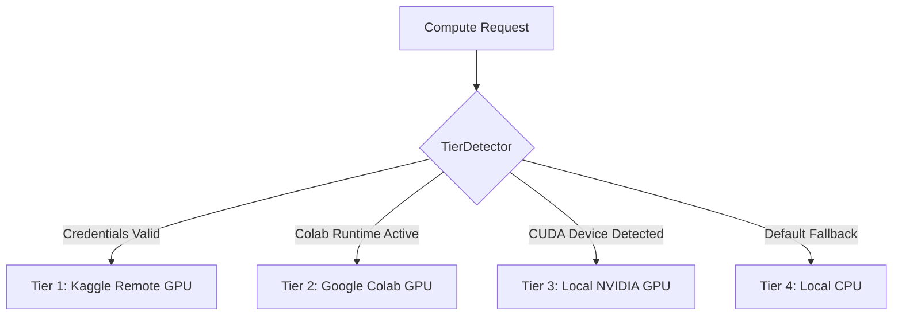

# Technology Stack & System Specifications

This document catalogs the complete technology stack, library versions, hardware acceleration tiers, and tooling infrastructure powering the **TQC (Truncated Quantile Critics - ICML 2020) Paper Reproduction & Analysis** project.

---

## 1. Core Runtime & Foundations

| Component | Specification | Description & Role |
|:---|:---|:---|
| **Python** | `3.10`, `3.11`, `3.12` | Core programming language; strictly typed with `typing` hints. |
| **Operating Systems** | Windows 10/11, Ubuntu 22.04+, macOS (Apple Silicon / Intel) | Multi-platform support. Shell scripts provided in PowerShell (`.ps1`) and Bash (`.sh`). |
| **Deep Learning Framework** | **PyTorch** (`>=2.2.0`) | Neural network training, automatic differentiation, GPU tensor acceleration, Polyak target updates. |
| **Reinforcement Learning** | **Gymnasium** (`>=0.29.0`) | Standard API for continuous control benchmark environments. |
| **Physics Simulator** | **MuJoCo** (`>=3.0.0`) | High-performance multi-joint physics engine natively integrated via `mujoco-python`. |

---

## 2. Mathematical & Scientific Computing

| Library | Version | Purpose |
|:---|:---|:---|
| **NumPy** | `>=1.24.0, <2.0.0` | Fast array operations, replay buffer storage, circular buffer memory management. |
| **SciPy** | `>=1.11.0` | Statistical evaluations, confidence interval calculations, cumulative distribution functions. |
| **Pandas** | `>=2.0.0` | Structured experiment logging, tabular benchmark results, CSV evaluation ingestion. |
| **PyYAML** | `>=6.0` | Declarative experiment presets, matrix configs (`configs/benchmark_matrix.yaml`). |

---

## 3. Visualization, Video Processing & Telemetry

| Library / Tool | Role in Codebase |
|:---|:---|
| **Matplotlib** (`>=3.7.0`) | Generating publication-ready learning curves, bias comparison plots, Q-value histograms. |
| **Seaborn** (`>=0.12.0`) | Statistical data visualization with shaded confidence intervals across multiple random seeds. |
| **ImageIO & FFmpeg** (`imageio-ffmpeg>=0.4.9`) | Rendering evaluation rollouts to MP4 video with custom HUD telemetry overlays. |
| **OpenCV** (`cv2`) | Frame compositing, HUD telemetry text rendering, 2x3 multi-policy visual comparison grids. |

---

## 4. Multi-Tier Compute Hierarchy

The system implements an automated 4-tier compute resolution engine (`src/tqc/compute/tier_detector.py` and `dispatcher.py`):

### Compute Tier Capabilities

1. **Tier 1 — Kaggle Cloud GPU (Priority 1)**:
   - **Hardware**: NVIDIA Tesla P100 (16 GB VRAM) or Dual Tesla T4.
   - **Allocation**: 30 GPU hours/week per developer.
   - **Throughput**: ~1,000,000 environment steps in ~45–60 minutes.
   - **Queue Management**: Dual-slot asynchronous queue manager (`DualSlotQueueManager`) enforcing Kaggle's 2-concurrent-GPU limit.
   - **Multi-Developer Scaling**: 3 developers with separate Kaggle accounts enable **6 concurrent GPU runs** (90 hours/week total).

2. **Tier 2 — Google Colab GPU (Priority 2)**:
   - **Hardware**: NVIDIA Tesla T4 (15 GB VRAM).
   - **Allocation**: Free/Pro dynamic instances.
   - **Integration**: Standalone generated notebook (`notebooks/colab_tqc_benchmark.ipynb`) with automated GitHub repository cloning, headless MuJoCo rendering, and Google Drive checkpoint backup.

3. **Tier 3 — Local NVIDIA GPU (Priority 3)**:
   - **Hardware**: NVIDIA GeForce RTX series or workstation GPUs with CUDA Compute Capability 7.0+.
   - **Acceleration**: cuDNN benchmark mode (`torch.backends.cudnn.benchmark = True`).

4. **Tier 4 — Local CPU (Priority 4)**:
   - **Hardware**: Multi-core x86_64 / ARM64.
   - **Usage**: Used for 100-step pre-flight smoke tests, deterministic unit tests, and rapid debugging.

---

## 5. Development, Testing & Workflow Tooling

- **Pytest** (`>=8.0.0`): Deterministic verification engine running 105 automated unit and integration tests.
- **Git & GitHub CLI (`gh`)**: Version control, feature branching, issue tracking, and automated PR linkage.
- **GSD (Get Stuff Done)**: Autonomous workflow engine governing planning, phase state management (`.planning/`), and execution safety gates.
