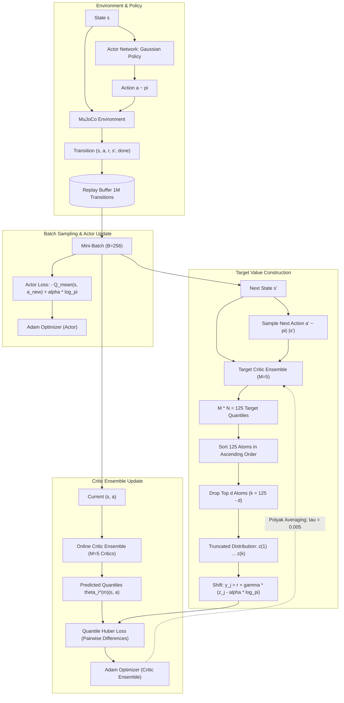

# Controlling Overestimation Bias with Truncated Mixture of Continuous Distributional Quantile Critics (TQC)

**Reference:** Arsenii Kuznetsov, Pavel Shvechikov, Alexander Grishin, Dmitry Vetrov (ICML 2020)  
**Official Codebase Reference:** `bayesgroup/tqc_pytorch`  
**Paper Link:** [PMLR 119:5556-5566](http://proceedings.mlr.press/v119/kuznetsov20a/kuznetsov20a.pdf)

---

## Table of Contents
1. [Executive Summary & Problem Motivation](#1-executive-summary--problem-motivation)
   - [The Overestimation Dilemma in Continuous RL](#the-overestimation-dilemma-in-continuous-rl)
   - [Maximization Bias & Bootstrapping Feedback Loops](#maximization-bias--bootstrapping-feedback-loops)
   - [The TQC Philosophy: Fine-Grained Bias Control](#the-tqc-philosophy-fine-grained-bias-control)
2. [Theoretical Foundations & Prior Baselines](#2-theoretical-foundations--prior-baselines)
   - [Soft Actor-Critic (SAC) & Maximum Entropy RL](#soft-actor-critic-sac--maximum-entropy-rl)
   - [Clipped Double Q-Learning in SAC and TD3](#clipped-double-q-learning-in-sac-and-td3)
   - [Why Minimum Clipping Fails: Underestimation vs. Persistent Overestimation](#why-minimum-clipping-fails-underestimation-vs-persistent-overestimation)
   - [Distributional Reinforcement Learning & Quantile Regression](#distributional-reinforcement-learning--quantile-regression)
3. [TQC Core Innovation: Distributional Ensembling & Truncation](#3-tqc-core-innovation-distributional-ensembling--truncation)
   - [From Scalar Value Expectations to Full Return Distributions](#from-scalar-value-expectations-to-full-return-distributions)
   - [Decoupling Aleatoric and Epistemic Uncertainty](#decoupling-aleatoric-and-epistemic-uncertainty)
   - [The Truncation Principle](#the-truncation-principle)
   - [High-Level Architectural Flow](#high-level-architectural-flow)
4. [Formal Mathematical Formulation](#4-formal-mathematical-formulation)
   - [Distributional Bellman Operator for Continuous Control](#distributional-bellman-operator-for-continuous-control)
   - [Quantile Representation of Critics](#quantile-representation-of-critics)
   - [Quantile Regression Huber Loss](#quantile-regression-huber-loss)
   - [Target Distribution via Truncated Mixture](#target-distribution-via-truncated-mixture)
   - [Actor Policy Optimization & Dual Temperature Tuning](#actor-policy-optimization--dual-temperature-tuning)
5. [Algorithmic Workflow & Operational Dynamics](#5-algorithmic-workflow--operational-dynamics)
   - [Step-by-Step Training Lifecycle](#step-by-step-training-lifecycle)
   - [Target Quantile Construction Visualized](#target-quantile-construction-visualized)
6. [Network Architectures & Hyperparameter Catalog](#6-network-architectures--hyperparameter-catalog)
   - [Actor Network Architecture](#actor-network-architecture)
   - [Critic Ensemble Architecture](#critic-ensemble-architecture)
   - [Global Hyperparameters Table](#global-hyperparameters-table)
   - [Environment-Specific Truncation Parameter ($d$)](#environment-specific-truncation-parameter-d)
7. [Empirical Performance & MuJoCo Benchmark Analysis](#7-empirical-performance--mujoco-benchmark-analysis)
   - [Benchmark Environments Overview](#benchmark-environments-overview)
   - [Comparative Sample Efficiency & Asymptotic Return](#comparative-sample-efficiency--asymptotic-return)
   - [Ablation Analysis: The Impact of $d$ and Ensemble Size $M$](#ablation-analysis-the-impact-of-d-and-ensemble-size-m)
   - [Why TQC Dominates High-Dimensional Control (Humanoid)](#why-tqc-dominates-high-dimensional-control-humanoid)
8. [Conclusion & Key Takeaways for Project Evaluation](#8-conclusion--key-takeaways-for-project-evaluation)

---

## 1. Executive Summary & Problem Motivation

### The Overestimation Dilemma in Continuous RL
In value-based reinforcement learning and actor-critic algorithms, the critic's fundamental objective is to estimate the expected cumulative discounted future reward (the Q-value) associated with taking action $a$ in state $s$:

$$Q^\pi(s, a) = \mathbb{E}_\pi \left[ \sum_{t=0}^\infty \gamma^t r_t \;\middle|\; s_0 = s, a_0 = a \right]$$

However, function approximators (such as deep neural networks) inevitably introduce approximation errors due to finite sampling, function capacity, and non-stationary targets. In continuous action spaces, the actor optimizes its policy by maximizing the critic's predicted values:

$$a^* = \arg\max_a Q(s, a)$$

Because the policy actively seeks out regions in the action space where the critic predicts the highest values, any noisy, stochastic, or erroneous over-estimations produced by the critic are disproportionately selected and reinforced.

### Maximization Bias & Bootstrapping Feedback Loops
This phenomenon is grounded in **Jensen's Inequality**: for any set of noisy random variables $\hat{Q}_i$, the expected value of their maximum is strictly greater than or equal to the maximum of their true expected values:

$$\mathbb{E}\left[ \max_a \hat{Q}(s, a) \right] \ge \max_a \mathbb{E}\left[ \hat{Q}(s, a) \right]$$

In temporal difference (TD) learning, the Bellman target relies on bootstrapping:

$$y = r(s, a) + \gamma \max_{a'} Q(s', a')$$

When an overestimated target $y$ is used to supervise the critic network, the error does not remain local; it compounds and cascades across transitions throughout the state-action space. Over multiple training iterations, this positive bias can explode, destabilizing training, deteriorating policy gradient directions, and leading to suboptimal or completely collapsed policies.

### The TQC Philosophy: Fine-Grained Bias Control
Prior methods such as Twin Delayed DDPG (TD3) and Soft Actor-Critic (SAC) combat overestimation by maintaining two critics and taking the minimum of their predictions:

$$y_{\text{target}} = r + \gamma \min_{j \in \{1, 2\}} Q_j(s', a')$$

While minimum clipping prevents catastrophic divergence, it is an **inflexible, crude, point-estimate heuristic**:
- In simple tasks with low stochasticity, taking the minimum across critics causes severe **underestimation bias**, slowing down learning and resulting in overly cautious policies.
- In complex, high-dimensional tasks (such as MuJoCo Humanoid), two critics are insufficient to counter severe estimation errors, leading to **persistent overestimation**.

**Truncated Quantile Critics (TQC)** solves this fundamental dilemma by moving from single scalar expected values to **full return distributions** using quantile regression, pooling distributions across an ensemble of critics, and applying a **parametric truncation operator** that systematically discards the rightmost (overly optimistic) tail of the return distribution. By tuning a single integer parameter $d$ (the number of quantiles dropped), TQC provides smooth, continuous, and fine-grained control over the estimation bias spectrum.

---

## 2. Theoretical Foundations & Prior Baselines

### Soft Actor-Critic (SAC) & Maximum Entropy RL
TQC is built on top of the **Maximum Entropy Reinforcement Learning** framework popularized by Soft Actor-Critic (Haarnoja et al., 2018). In standard RL, the goal is to maximize the expected sum of rewards. In Maximum Entropy RL, the agent maximizes expected reward augmented with the policy's Shannon entropy:

$$J(\pi) = \sum_{t=0}^\infty \mathbb{E}_{(s_t, a_t) \sim \rho_\pi} \left[ \gamma^t \Big( r(s_t, a_t) + \alpha \mathcal{H}(\pi(\cdot | s_t)) \Big) \right]$$

where:
- $\mathcal{H}(\pi(\cdot | s_t)) = -\mathbb{E}_{a \sim \pi} [\log \pi(a | s_t)]$ is the entropy of the action distribution at state $s_t$.
- $\alpha > 0$ is the **temperature parameter** determining the relative trade-off between reward exploitation and policy entropy (exploration).

The corresponding soft state-action value satisfies the soft Bellman equation:

$$Q(s, a) = r(s, a) + \gamma \mathbb{E}_{s' \sim p} \left[ V(s') \right]$$

where the soft state value $V(s')$ is defined as:

$$V(s') = \mathbb{E}_{a' \sim \pi} \left[ Q(s', a') - \alpha \log \pi(a' | s') \right]$$

### Clipped Double Q-Learning in SAC and TD3
To counter overestimation bias, SAC and TD3 maintain two independent critic networks, $Q_{\phi_1}$ and $Q_{\phi_2}$, and calculate the target value using the minimum operator:

$$y_{\text{SAC}} = r(s, a) + \gamma \left( \min_{j=1,2} Q_{\bar{\phi}_j}(s', a') - \alpha \log \pi_\theta(a' | s') \right), \quad a' \sim \pi_\theta(\cdot | s')$$

where $\bar{\phi}_j$ denotes target critic parameters updated via Polyak averaging:

$$\bar{\phi}_j \leftarrow \tau \phi_j + (1 - \tau) \bar{\phi}_j, \quad \tau \in (0, 1)$$

### Why Minimum Clipping Fails: Underestimation vs. Persistent Overestimation
The minimum operator $\min(Q_1, Q_2)$ introduces significant limitations:
1. **Underestimation Pathology:** By always selecting the minimum, the algorithm often underestimates values. In environments with long horizons or sparse rewards, underestimation slows down propagation of reward signals across the state space.
2. **Binary Choice / Lack of Knobs:** The designer only has two crude knobs: $M=1$ (standard Q-learning, massive overestimation) or $M=2$ (clipped double Q-learning, frequent underestimation). There is no mechanism to set intermediate bias levels.
3. **Failure in High Dimensions:** In complex environments with large state-action spaces (e.g., Humanoid with 376 observation dimensions and 17 continuous action dimensions), approximation errors are large. Two critics often both produce overestimated values for out-of-distribution actions, rendering the minimum heuristic ineffective.

### Distributional Reinforcement Learning & Quantile Regression
Rather than modeling only the expectation $Q(s, a) = \mathbb{E}[Z(s, a)]$, **Distributional RL** (Bellemare et al., 2017) models the entire random variable of cumulative returns:

$$Z(s, a) = \sum_{t=0}^\infty \gamma^t r_t, \quad s_0 = s, a_0 = a$$

The distributional Bellman equation governs the distribution of $Z$:

$$Z(s, a) \stackrel{D}{=} r(s, a) + \gamma Z(s', a')$$

where $\stackrel{D}{=}$ denotes equality in distribution.

In **Quantile Regression DQN (QR-DQN)** (Dabney et al., 2018), the cumulative distribution function (CDF) of $Z(s, a)$ is approximated by a uniform mixture of $N$ Dirac delta atoms placed at quantile values:

$$Z_\theta(s, a) = \frac{1}{N} \sum_{i=1}^N \delta_{\theta_i(s, a)}$$

Each atom $\theta_i(s, a)$ corresponds to the quantile of the return distribution at cumulative probability:

$$\tau_i = \frac{2i - 1}{2N}, \quad \text{for } i \in \{1, \dots, N\}$$

---

## 3. TQC Core Innovation: Distributional Ensembling & Truncation

### From Scalar Value Expectations to Full Return Distributions
While QR-DQN used quantiles in discrete action domains (Atari), TQC adapts quantile representations to continuous actor-critic control. By learning $N$ quantiles per critic, the network outputs an ordered set of return estimates:

$$\theta_1(s, a) \le \theta_2(s, a) \le \dots \le \theta_N(s, a)$$

Instead of a single scalar number, the agent has access to the full spread of possible outcomes, ranging from conservative/pessimistic returns ($\theta_1$) to optimistic returns ($\theta_N$).

### Decoupling Aleatoric and Epistemic Uncertainty
Continuous reinforcement learning faces two distinct sources of uncertainty:
1. **Aleatoric Uncertainty (Intrinsic Randomness):** Uncertainty inherent in the environment dynamics, state transitions, and reward functions. This uncertainty cannot be reduced by collecting more data.
2. **Epistemic Uncertainty (Approximation Error):** Uncertainty arising from limited data, lack of visits to specific state-action regions, and neural network function approximation errors.

TQC elegantly addresses both:
- **Quantiles** capture the **aleatoric distribution** of returns (the shape and spread of the return distribution).
- **An ensemble of $M$ independent critics** captures **epistemic uncertainty** (divergence and variation between independent models).

### The Truncation Principle
When an ensemble of $M$ critics each predicts $N$ quantiles, we obtain a pool of $M \times N$ atoms representing the mixture distribution:

$$\mathcal{Z}(s, a) = \bigcup_{m=1}^M \left\{ \theta_1^{(m)}(s, a), \theta_2^{(m)}(s, a), \dots, \theta_N^{(m)}(s, a) \right\}$$

Because maximization bias drives the actor toward the highest, most optimistic value predictions, the **right tail** of this pooled distribution is predominantly corrupted by positive approximation errors.

TQC introduces the **Truncation Operator** $\mathcal{T}_{\text{trunc}}^{(d)}$:
1. Pool all $M \times N$ quantiles from all $M$ target critics.
2. Sort them in ascending order:
   $$z_{(1)} \le z_{(2)} \le \dots \le z_{(MN)}$$
3. **Drop the top $d$ atoms** (the rightmost tail):
   $$\mathcal{Z}_{\text{trunc}} = \left\{ z_{(1)}, z_{(2)}, \dots, z_{(k)} \right\}, \quad k = MN - d$$
4. Compute the target value using only the remaining $k$ truncated atoms.

```
Pooled Quantiles (Sorted):
[ z(1),  z(2),  z(3),  ... ,  z(k)  |  z(k+1), ... , z(MN) ]
<---------- Retained Quantiles ------> | <-- Dropped (d atoms) ->
           (Used for Target)           |  (Optimistic Outliers)
```

By varying the single integer parameter $d \in [0, MN - 1]$:
- When $d = 0$: Standard ensemble mean without truncation (optimistic, overestimating).
- When $d$ is moderate ($d = 5$ for $M=5, N=25$): Mitigates overestimation bias while preserving rich distributional information.
- When $d$ is large: Approaches conservative lower-bound estimation (pessimistic).

### High-Level Architectural Flow



---

## 4. Formal Mathematical Formulation

### Distributional Bellman Operator for Continuous Control
Let $\mathcal{P}^\pi$ denote the transition distribution under policy $\pi$. The entropy-regularized distributional Bellman operator $\mathcal{T}^\pi$ acting on return distribution $Z(s, a)$ is defined as:

$$\mathcal{T}^\pi Z(s, a) \stackrel{D}{:=} r(s, a) + \gamma \left( Z(s', a') - \alpha \log \pi(a' | s') \right), \quad s' \sim p(\cdot | s, a), \; a' \sim \pi(\cdot | s')$$

### Quantile Representation of Critics
Each critic $m \in \{1, \dots, M\}$ is parameterized by a neural network $\psi_m$ taking state-action pair $(s, a)$ as input and outputting $N$ real-valued quantiles:

$$\theta^{(m)}(s, a) = \left( \theta_1^{(m)}(s, a), \theta_2^{(m)}(s, a), \dots, \theta_N^{(m)}(s, a) \right) \in \mathbb{R}^N$$

Each quantile index $i \in \{1, \dots, N\}$ corresponds to cumulative probability:

$$\tau_i = \frac{2i - 1}{2N}$$

### Quantile Regression Huber Loss
In quantile regression, the loss function penalizes quantile estimation errors asymmetrically. For a prediction error $u = y - \theta$, the quantile loss with threshold $\tau \in (0, 1)$ is:

$$\rho_\tau(u) = u \cdot (\tau - \mathbb{I}\{u < 0\})$$

To prevent non-smooth gradients at $u = 0$, the standard quantile loss is combined with the **Huber Loss** with threshold $\kappa = 1.0$:

$$\mathcal{L}_\kappa(u) = \begin{cases} \frac{1}{2} u^2, & \text{if } |u| \le \kappa \\ \kappa \left( |u| - \frac{1}{2} \kappa \right), & \text{otherwise} \end{cases}$$

The **Huber Quantile Regression Loss** $\rho_\tau^\kappa(u)$ is defined as:

$$\rho_\tau^\kappa(u) = |\tau - \mathbb{I}\{u < 0\}| \frac{\mathcal{L}_\kappa(u)}{\kappa}$$

Given target values $y_j \in Y_{\text{target}}$ and predicted quantiles $\theta_i^{(m)}(s, a)$, the critic loss for ensemble member $m$ across batch transitions is:

$$\mathcal{L}_{\text{critic}}(\psi_m) = \frac{1}{|Y_{\text{target}}|} \sum_{j=1}^{|Y_{\text{target}}|} \frac{1}{N} \sum_{i=1}^N \rho_{\tau_i}^\kappa \left( y_j - \theta_i^{(m)}(s, a) \right)$$

The total critic loss is averaged across all $M$ critics:

$$\mathcal{L}_{\text{total\_critic}} = \sum_{m=1}^M \mathcal{L}_{\text{critic}}(\psi_m)$$

### Target Distribution via Truncated Mixture
At the next transition state $s'$, a candidate action is sampled from the current policy:

$$a' \sim \pi_\phi(\cdot | s')$$

All $M$ target critic networks (parameterized by target weights $\bar{\psi}_m$) evaluate $(s', a')$:

$$\Theta_{\text{target}} = \bigcup_{m=1}^M \left\{ \theta_1^{(m)}(s', a'; \bar{\psi}_m), \dots, \theta_N^{(m)}(s', a'; \bar{\psi}_m) \right\}$$

This forms a multiset of $K_{\text{total}} = M \times N$ scalar atoms.

1. **Sort all atoms:**
   $$\text{Sort}(\Theta_{\text{target}}) = \left( z_{(1)}, z_{(2)}, \dots, z_{(MN)} \right) \quad \text{such that } z_{(1)} \le z_{(2)} \le \dots \le z_{(MN)}$$

2. **Truncate top $d$ atoms:**
   $$k = MN - d$$
   $$\mathcal{Z}_{\text{trunc}} = \left\{ z_{(1)}, z_{(2)}, \dots, z_{(k)} \right\}$$

3. **Construct Bellman target atoms:**
   For each retained atom $z_{(j)} \in \mathcal{Z}_{\text{trunc}}$ where $j \in \{1, \dots, k\}$:
   $$y_j = r(s, a) + \gamma (1 - \text{done}) \cdot \left( z_{(j)} - \alpha \log \pi_\phi(a' | s') \right)$$

This yields $|Y_{\text{target}}| = k = MN - d$ target values for computing the Huber quantile regression loss.

### Actor Policy Optimization & Dual Temperature Tuning

#### Policy Representation
The actor policy $\pi_\phi(a | s)$ outputs the parameters of a diagonal Gaussian distribution. Actions are squashed to the valid interval $[-1, 1]$ via the hyperbolic tangent:

$$\tilde{a} \sim \mathcal{N}\left( \mu_\phi(s), \sigma_\phi(s) \right)$$
$$a = \tanh(\tilde{a})$$

The log-probability accounting for the Jacobian of the tanh squashing transformation is:

$$\log \pi_\phi(a | s) = \log \mu(\tilde{a} | s) - \sum_{i=1}^{\dim(\mathcal{A})} \log \left( 1 - \tanh^2(\tilde{a}_i) + \epsilon \right)$$

#### Policy Objective
The policy maximizes the expected state-action value minus entropy cost:

$$\mathcal{L}_{\text{actor}}(\phi) = \mathbb{E}_{s \sim \mathcal{D}, \, \tilde{a} \sim \pi_\phi} \left[ \alpha \log \pi_\phi(a | s) - Q_{\text{mean}}(s, a) \right]$$

where $Q_{\text{mean}}(s, a)$ is the average over all predicted quantiles across all $M$ critics:

$$Q_{\text{mean}}(s, a) = \frac{1}{M \cdot N} \sum_{m=1}^M \sum_{i=1}^N \theta_i^{(m)}(s, a)$$

#### Automatic Entropy Temperature Tuning ($\alpha$)
Following Haarnoja et al. (2018), the temperature $\alpha$ is dynamically adjusted using dual gradient descent to maintain a target entropy $\bar{\mathcal{H}} = -\dim(\mathcal{A})$:

$$\mathcal{L}(\alpha) = \mathbb{E}_{s \sim \mathcal{D}, \, a \sim \pi_\phi} \left[ -\alpha \cdot \left( \log \pi_\phi(a | s) + \bar{\mathcal{H}} \right) \right]$$

In practice, $\log \alpha$ is optimized to ensure numerical stability and guarantee $\alpha > 0$.

---

## 5. Algorithmic Workflow & Operational Dynamics

### Step-by-Step Training Lifecycle
The execution loop of TQC operates in discrete, sequential phases:

```
[Initialization]
  ├── Initialize Actor π_φ, Critics ψ_1..M, Target Critics ψ̄_1..M ← ψ_1..M
  ├── Initialize Entropy Temperature α, Target Entropy H̄ = -dim(A)
  └── Initialize Replay Buffer D of capacity 1,000,000

[Environment Interaction Loop]
  ├── Observe state s
  ├── Sample action:
  │     If t < start_steps: a ~ Uniform(-1, 1) [Random exploration]
  │     Else: a ~ π_φ(· | s) [Stochastic Gaussian policy]
  ├── Step environment: s', r, done ← Env.step(a)
  ├── Store transition (s, a, r, s', done) in Replay Buffer D
  └── Update state: s ← s' (or reset if done)

[Training Update Step (Executed every environment step after start_steps)]
  ├── Sample mini-batch of B=256 transitions from D
  │
  ├── [Target Value Calculation]
  │     ├── Sample candidate next actions: a' ~ π_φ(· | s')
  │     ├── Compute next log-probs: log π_φ(a' | s')
  │     ├── Forward pass all M target critics: Θ = { ψ̄_m(s', a') }  (M * N = 125 atoms)
  │     ├── Sort all 125 atoms in ascending order
  │     ├── Truncate: keep lowest k = 125 - d atoms (drop top d)
  │     └── Construct target values: y_j = r + γ * (1 - done) * (z_(j) - α * log π_φ(a' | s'))
  │
  ├── [Critic Ensemble Optimization]
  │     ├── Forward pass all M online critics on (s, a): θ_i^(m)(s, a)
  │     ├── Compute pairwise Huber quantile loss against y_j
  │     ├── Average loss over k targets, N quantiles, and M critics
  │     └── Backward pass & Adam optimizer step on critic parameters ψ_1..M
  │
  ├── [Actor Policy Optimization]
  │     ├── Re-sample fresh actions for current state: a_new ~ π_φ(· | s)
  │     ├── Compute Q_mean(s, a_new) over all M online critics and N quantiles
  │     ├── Formulate policy loss: α * log π_φ(a_new | s) - Q_mean(s, a_new)
  │     └── Backward pass & Adam optimizer step on actor parameters φ
  │
  ├── [Temperature α Optimization]
  │     ├── Compute temperature loss: -log(α) * (log π_φ(a_new | s) + H̄).detach()
  │     └── Backward pass & Adam optimizer step on log(α)
  │
  └── [Target Network Soft Update]
        └── For each critic m ∈ {1, ..., M}:
              ψ̄_m ← τ * ψ_m + (1 - τ) * ψ̄_m  (with τ = 0.005)
```

### Target Quantile Construction Visualized
To provide visual intuition for how the $M \times N$ quantiles are processed, consider an ensemble of $M=5$ critics with $N=25$ quantiles each ($125$ total quantiles) and truncation parameter $d=5$:

```
Critic 1:  [  θ_1^(1),  θ_2^(1),  ...,  θ_25^(1)  ]  (25 quantiles)
Critic 2:  [  θ_1^(2),  θ_2^(2),  ...,  θ_25^(2)  ]  (25 quantiles)
Critic 3:  [  θ_1^(3),  θ_2^(3),  ...,  θ_25^(3)  ]  (25 quantiles)
Critic 4:  [  θ_1^(4),  θ_2^(4),  ...,  θ_25^(4)  ]  (25 quantiles)
Critic 5:  [  θ_1^(5),  θ_2^(5),  ...,  θ_25^(5)  ]  (25 quantiles)
                                  │
                          [ POOL & MERGE ]
                                  │
                                  ▼
Unsorted Pool: [ 125 scalar return values ]
                                  │
                           [ ASCENDING SORT ]
                                  │
                                  ▼
Sorted Array:  [ z_(1), z_(2), z_(3), ... , z_(120)  |  z_(121), z_(122), z_(123), z_(124), z_(125) ]
               └────────────────────────────────────┘   └────────────────────────────────────────────┘
                   Retained: k = 120 Atoms                 Dropped: Top d = 5 Atoms (Overestimations)
                                  │
                                  ▼
       Bellman Shift: y_j = r + γ * (z_(j) - α * log π)  for j = 1 ... 120
                                  │
                                  ▼
           Supervision signal for online critics' quantile loss
```

---

## 6. Network Architectures & Hyperparameter Catalog

### Actor Network Architecture
The actor is a Multi-Layer Perceptron (MLP) mapping the observation vector $s \in \mathbb{R}^{\dim(\mathcal{S})}$ to mean and log-standard deviation vectors:
- **Input Dimension:** State space dimension $\dim(\mathcal{S})$
- **Hidden Layers:** 3 linear layers with 512 hidden units each
- **Nonlinear Activations:** ReLU after each hidden layer
- **Output Heads:**
  - Mean Head: Linear Layer ($512 \to \dim(\mathcal{A})$)
  - Log Std Head: Linear Layer ($512 \to \dim(\mathcal{A})$), clamped to $[\text{LOG\_STD\_MIN}=-20, \; \text{LOG\_STD\_MAX}=2]$
- **Squashing Function:** Hyperbolic tangent $\tanh(\cdot)$ applied to sampled Gaussian latent vectors

### Critic Ensemble Architecture
The critic consists of $M=5$ completely independent neural networks (no shared weights):
- **Input Dimension:** Concatenation of state and action $[\dim(\mathcal{S}) + \dim(\mathcal{A})]$
- **Hidden Layers:** 3 linear layers with 512 hidden units each per critic
- **Nonlinear Activations:** ReLU after each hidden layer
- **Output Layer:** Linear Layer ($512 \to N=25$) predicting the 25 quantile locations $\theta_1, \dots, \theta_{25}$

### Global Hyperparameters Table

| Hyperparameter | Symbol | Value in Paper / Reference Implementation | Description |
|---|---|---|---|
| Critic Ensemble Size | $M$ | $5$ | Number of independent critic networks |
| Quantiles per Critic | $N$ | $25$ | Number of quantiles predicted by each critic |
| Total Quantile Atoms | $MN$ | $125$ | Total number of atoms before truncation |
| Discount Factor | $\gamma$ | $0.99$ | Standard discount factor for MDP horizon |
| Target Smoothing Coefficient | $\tau$ | $0.005$ | Polyak averaging rate for target critic updates |
| Actor Learning Rate | $\eta_{\text{actor}}$ | $3 \times 10^{-4}$ | Adam learning rate for policy network |
| Critic Learning Rate | $\eta_{\text{critic}}$ | $3 \times 10^{-4}$ | Adam learning rate for critic ensemble |
| Temperature Learning Rate | $\eta_\alpha$ | $3 \times 10^{-4}$ | Adam learning rate for entropy temperature |
| Optimizer | — | Adam $(\beta_1 = 0.9, \; \beta_2 = 0.999)$ | Gradient optimization algorithm |
| Batch Size | $B$ | $256$ | Mini-batch sample size from replay buffer |
| Replay Buffer Capacity | $|\mathcal{D}|$ | $1\,000\,000$ transitions | First-in-first-out uniform replay memory |
| Warm-up Steps | — | $10\,000$ steps (or $1\,000$ depending on env) | Steps of purely random exploratory actions |
| Huber Loss Threshold | $\kappa$ | $1.0$ | Threshold parameter for Huber quantile loss |
| Target Entropy | $\bar{\mathcal{H}}$ | $-\dim(\mathcal{A})$ | Target heuristic for automatic temperature tuning |
| Policy Update Frequency | — | $1$ per critic step | Actor updated at the same frequency as critics |

### Environment-Specific Truncation Parameter ($d$)
The paper establishes optimal values for the truncation parameter $d$ across standard benchmark environments:

| Environment | Observation Dim | Action Dim | Truncation Drop ($d$) | Retained Atoms ($k = 125 - d$) | Rationale |
|---|---|---|---|---|---|
| **HalfCheetah-v3** | 17 | 6 | **5** (or $2.5 \times M$) | 120 | Moderate dynamics; dropping top 5% controls bias smoothly |
| **Hopper-v3** | 11 | 3 | **5** | 120 | Unstable balance dynamics; prevents optimistic falling trajectories |
| **Walker2d-v3** | 17 | 6 | **5** | 120 | Bipedal locomotion; standard $d=5$ achieves robust gait |
| **Ant-v3** | 111 | 8 | **5** (or **2**) | 120 (or 123) | Quadrupedal locomotion; benefits from mild truncation |
| **Humanoid-v3** | 376 | 17 | **2** (or $d/M = 0.4$) | 123 | Very high dimension; requires minimal drop ($d=2$) to maintain learning signal while preventing overestimation collapse |

---

## 7. Empirical Performance & MuJoCo Benchmark Analysis

### Benchmark Environments Overview
The Kuznetsov et al. (ICML 2020) paper benchmarked TQC across the standard continuous control suite from OpenAI Gym / MuJoCo physics engine:
1. **HalfCheetah-v3:** A planar 2D 8-link cheetah-like robot learning forward sprint.
2. **Hopper-v3:** A 2D single-legged robot that must balance and hop forward without falling over.
3. **Walker2d-v3:** A 2D bipedal robot required to coordinate dual legs to walk forward.
4. **Ant-v3:** A 3D quadruped robot navigating a 3D terrain requiring coordinated joint torques.
5. **Humanoid-v3:** A highly complex 3D 21-link humanoid with 17 continuous joints, prone to immediate collapse.

### Comparative Sample Efficiency & Asymptotic Return
In the published empirical evaluation across 10 random seeds per environment, TQC achieved state-of-the-art results:

| Environment | Steps | SAC Baseline | TD3 Baseline | TQC (Reported) | Relative Gain over SAC |
|---|---|---|---|---|---|
| **HalfCheetah-v3** | 1M | $\approx 11\,500$ | $\approx 9\,800$ | $\mathbf{\approx 12\,800}$ | $+11.3\%$ |
| **Hopper-v3** | 1M | $\approx 3\,400$ | $\approx 3\,500$ | $\mathbf{\approx 3\,750}$ | $+10.3\%$ |
| **Walker2d-v3** | 1M | $\approx 4\,500$ | $\approx 4\,400$ | $\mathbf{\approx 5\,300}$ | $+17.8\%$ |
| **Ant-v3** | 1M | $\approx 5\,800$ | $\approx 4\,500$ | $\mathbf{\approx 6\,900}$ | $+19.0\%$ |
| **Humanoid-v3** | 1M | $\approx 5\,900$ | $\approx 5\,200$ | $\mathbf{\approx 8\,200}$ | $\mathbf{+39.0\%}$ |
| **Humanoid-v3** | 3M | $\approx 6\,400$ | $\approx 5\,600$ | $\mathbf{\approx 9\,400}$ | $\mathbf{+46.9\%}$ |

### Ablation Analysis: The Impact of $d$ and Ensemble Size $M$
The authors conducted extensive ablation experiments testing the behavior of the algorithm under various configurations:

#### 1. Varying the Truncation Parameter ($d$)
- **$d = 0$ (No Truncation):** Significant overestimation occurs. In Humanoid, overestimation causes the agent's performance to plateau early or collapse.
- **$d = 2 \text{ to } 5$ (Optimal Zone):** Estimation bias remains close to zero (or slightly negative), stabilizing policy gradient updates and yielding the highest returns.
- **$d \ge 10$ (Excessive Truncation):** Severe underestimation occurs. The value targets become overly pessimistic, slowing down policy progress and causing the policy to settle in conservative local optima.

#### 2. Varying the Ensemble Size ($M$)
- With $M=1$ (single critic), truncation cannot separate epistemic error from true distribution quantiles. Performance is suboptimal.
- Moving from $M=2$ to $M=5$ yields substantial gains because 5 critics provide enough discrete samples across the joint distribution for the truncation operator to reliably filter epistemic outliers.
- Increasing $M > 5$ provides diminishing returns relative to the additional computational and memory overhead.

### Why TQC Dominates High-Dimensional Control (Humanoid)
The performance gap between TQC and standard SAC is most dramatic on **Humanoid-v3** (approaching a $+47\%$ improvement at 3 million steps). This occurs because:
1. **Curse of Dimensionality in Action Space:** In $\mathbb{R}^{17}$, there are infinitely many directions where random function approximation errors can create spurious peaks in the critic landscape. SAC's two-critic minimum operator is frequently misled because both critics can produce spuriously high values.
2. **Distributional Richness:** Distributional quantile critics capture the multi-modal distribution of falling vs. maintaining balance. Truncation selectively removes optimistic hallucinations of recovery without collapsing the entire distribution down to a single pessimistic minimum.

---

## 8. Conclusion & Key Takeaways for Project Evaluation

1. **Theoretical Clarity:** Overestimation bias in actor-critic continuous control is fundamentally caused by maximization over noisy function approximators. While TD3 and SAC use clipped double Q-learning, that point-estimate heuristic lacks granular control.
2. **Core Architectural Innovation:** TQC unites continuous distributional quantile regression with ensembling ($M=5, N=25$) and introduces a parametric truncation operator $\mathcal{T}_{\text{trunc}}^{(d)}$.
3. **Mechanism of Action:** By sorting all $MN=125$ quantiles and discarding the top $d$ atoms, TQC cleanly excises optimistic outlier errors while preserving the underlying distribution of environmental returns.
4. **Empirical Supremacy:** TQC consistently outperforms SAC and TD3 across MuJoCo locomotion benchmarks, delivering its greatest improvements in high-dimensional continuous control tasks (Ant and Humanoid).
5. **Reproduction Roadmap Alignment:**
   - **Phase 1 (Complete):** Established the complete theoretical foundation in this document.
   - **Phase 2 (Upcoming):** Construct the modular PyTorch implementation of the squashed Gaussian actor, $M=5$ quantile critic ensemble, Huber quantile loss, and truncation operator matching `bayesgroup/tqc_pytorch`.
   - **Phase 3 (Upcoming):** Integrate the Gymnasium MuJoCo environment harness, 1M replay buffer, and multi-seed training runner.
   - **Phase 4 (Upcoming):** Run benchmark reproduction experiments and generate empirical replication curves against the published paper's figures.
